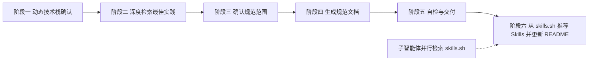
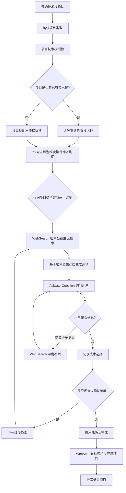
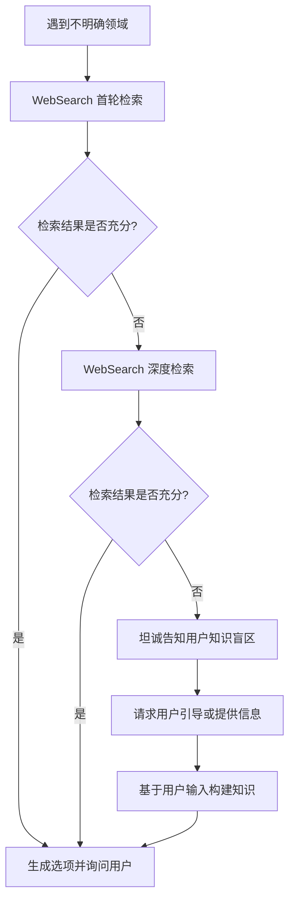
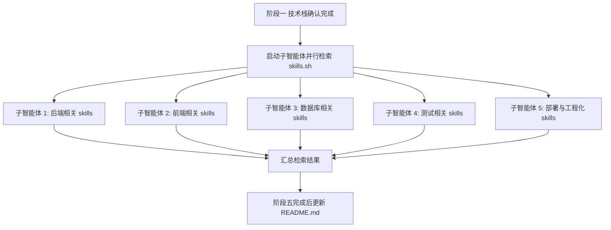
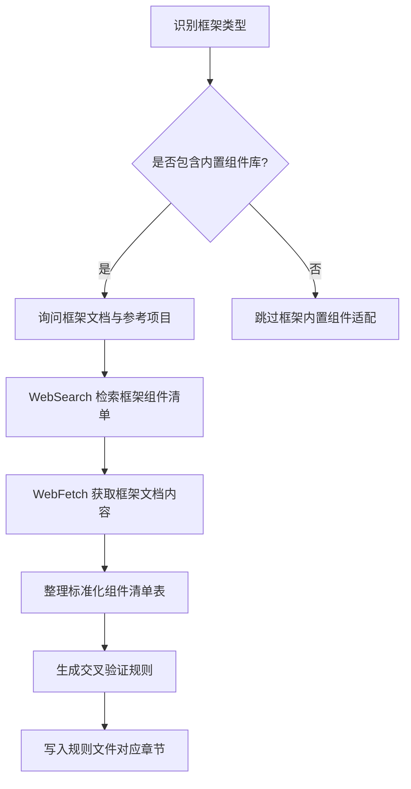

# 项目规范体系生成器（spec-generator）

本技能基于《通用项目规范体系设计指南》（`通用项目规范体系设计指南.md`）的五大支柱思想框架，为任意技术栈的全栈项目生成一套完整、专业且针对性强的规范文档体系。

**核心设计理念**：本技能不采用固定方法的直接植入，而是通过对核心思想的理解与应用，通过动态学习与用户沟通构建解决方案框架。特别针对后端等可能存在知识盲区的领域，建立动态学习和信息检索机制，确保规范生成的适应性和时效性。

## 一、何时触发本技能

以下任一场景命中时，必须触发本技能：

- 用户要求生成项目规范、规范体系、规范文档
- 用户要求创建`AGENTS.md`或`.agents/rules/`规则文件
- 用户要求为新项目或现有项目搭建标准化规范
- 用户要求基于《通用项目规范体系设计指南》生成规范
- 用户要求为特定技术栈定制规范文档
- 用户要求整合技术最佳实践与项目规范

## 二、核心执行流程

本技能严格按以下六个阶段顺序执行，不得跳过任何阶段：



### 阶段一：动态技术栈确认流程

**设计理念**：本阶段不预设固定技术选项，而是通过「项目类型确认 → 项目技术栈预检 → 实时网络检索 → 动态生成选项 → 用户确认」的循环与用户共同确定适用技术。这体现了适应性学习而非简单的预设匹配，特别针对后端等可能存在知识盲区的领域，建立动态学习和信息检索机制。

**强制要求**：

1. 禁止使用硬编码的固定技术选项列表
2. **必须先确认项目类型**（全栈/仅前端/仅后端），项目类型决定后续所有维度询问和规范生成范围
3. **每次执行必须先读取项目已有技术栈**（预检步骤，不可跳过）
4. 每轮询问前必须通过`WebSearch`检索当前主流技术方案
5. 每次`AskUserQuestion`询问必须提供至少 3 个选项
6. 用户始终可通过「Other」自定义输入（`AskUserQuestion`工具内置支持）
7. 禁止在未完成技术栈确认前进入阶段二

#### 1.0 前置：项目类型确认（强制第一步）

**强制要求**：在任何预检和 WebSearch 检索之前，必须先通过`AskUserQuestion`询问用户项目类型。项目类型决定后续技术栈确认维度和规范生成范围。

**项目类型定义**：

| 项目类型 | 说明 | 适用的技术维度 | 生成的规范文件 |
|----------|------|---------------|---------------|
| 全栈项目 | 包含前端和后端的完整项目 | 全部维度（后端、前端、数据库、ORM、工程化、基础设施、框架组件） | 全部规范文件 |
| 仅前端 | 纯前端项目，无后端和数据库 | 前端框架、前端工程化（构建工具、测试框架）、前端框架组件 | 跳过后端、数据库、ORM、缓存、数据权限相关规范 |
| 仅后端 | 纯后端项目，无前端 UI | 后端语言与框架、数据库、ORM、后端工程化、基础设施 | 跳过前端 UI 相关规范 |

**询问方式**：

通过`AskUserQuestion`询问用户，提供以下选项：

1. 全栈项目（推荐）- 包含前端和后端，生成完整规范体系
2. 仅前端 - 纯前端项目，跳过数据库、后端、缓存等规范
3. 仅后端 - 纯后端项目，跳过前端 UI 相关规范

**项目类型对后续流程的影响**：

- **技术栈预检**：根据项目类型过滤预检文件清单（如仅前端项目不检查`go.mod`、`pom.xml`等后端配置文件）
- **维度询问**：根据项目类型跳过不适用的维度（如仅前端项目跳过数据库、ORM 维度）
- **规范范围确认**：根据项目类型预选规则域（阶段三）
- **规范文件生成**：根据项目类型跳过不适用的规范文件（阶段四）
- **Skills 推荐**：根据项目类型过滤检索维度（阶段六）

**项目类型与维度映射**：

| 技术维度 | 全栈项目 | 仅前端 | 仅后端 |
|----------|----------|--------|--------|
| 后端语言与框架 | ✅ 必问 | ❌ 跳过 | ✅ 必问 |
| 前端框架 | ✅ 必问 | ✅ 必问 | ❌ 跳过 |
| 数据库 | ✅ 必问 | ❌ 跳过 | ✅ 必问 |
| ORM/数据访问层 | ✅ 必问 | ❌ 跳过 | ✅ 必问 |
| 工程化栈 | ✅ 必问 | ✅ 必问（前端工程化） | ✅ 必问（后端工程化） |
| 基础设施与部署 | ✅ 必问 | ✅ 必问 | ✅ 必问 |
| 框架内置组件体系 | ✅ 必问 | ✅ 必问（前端组件） | ✅ 必问（后端能力） |
| 缓存方案 | ✅ 必问 | ❌ 跳过 | ✅ 必问 |

#### 1.1 项目技术栈预检（强制前置步骤）

**强制要求**：在开始任何 WebSearch 检索和用户询问前，必须先读取项目根目录及子目录的配置文件，识别项目已有的技术栈信息。

**预检文件清单**：

必须按以下顺序检查项目根目录及子目录是否存在以下文件，若存在则读取并提取技术栈信息。**根据 1.0 确认的项目类型，仅检查适用的文件**：

| 文件 | 技术维度 | 适用项目类型 | 提取内容 |
|------|----------|-------------|----------|
| `package.json` | 前端/后端/工程化 | 全部类型 | `dependencies`、`devDependencies`中的框架、ORM、测试框架、构建工具 |
| `go.mod` | 后端（Go） | 全栈、仅后端 | Go 版本、依赖的框架（如 GoFrame、Gin、Echo 等） |
| `pom.xml` | 后端（Java） | 全栈、仅后端 | Java 版本、Spring Boot 版本、依赖的 ORM、测试框架 |
| `build.gradle` | 后端（Java） | 全栈、仅后端 | Java 版本、框架、ORM、测试框架 |
| `requirements.txt` / `pyproject.toml` | 后端（Python） | 全栈、仅后端 | Python 版本、框架（FastAPI、Django 等）、ORM、测试框架 |
| `Cargo.toml` | 后端（Rust） | 全栈、仅后端 | Rust 版本、框架、ORM |
| `composer.json` | 后端（PHP） | 全栈、仅后端 | PHP 版本、框架（Laravel、Symfony 等） |
| `vite.config.*` | 前端构建 | 全栈、仅前端 | 构建工具为 Vite，提取插件配置 |
| `vue.config.*` | 前端框架 | 全栈、仅前端 | 前端框架为 Vue |
| `next.config.*` | 前端框架 | 全栈、仅前端 | 前端框架为 Next.js |
| `nuxt.config.*` | 前端框架 | 全栈、仅前端 | 前端框架为 Nuxt |
| `prisma/schema.prisma` | ORM | 全栈、仅后端 | ORM 为 Prisma，提取数据库类型 |
| `ormconfig.*` | ORM | 全栈、仅后端 | ORM 为 TypeORM，提取数据库类型 |
| `Dockerfile` / `docker-compose.yml` | 部署 | 全部类型 | 部署方式为 Docker |
| `.github/workflows/*.yml` | CI/CD | 全部类型 | CI/CD 为 GitHub Actions |
| `.gitlab-ci.yml` | CI/CD | 全部类型 | CI/CD 为 GitLab CI |
| `Makefile` / `make.cmd` | 开发工具 | 全部类型 | 构建工具和命令 |
| `pnpm-lock.yaml` / `yarn.lock` | 包管理器 | 全部类型 | 包管理器为 pnpm 或 yarn |
| `go.sum` | 包管理器 | 全栈、仅后端 | Go modules |

**预检执行流程**：

1. 使用`Glob`工具扫描项目根目录，检查上述文件是否存在（仅检查与项目类型匹配的文件）
2. 使用`Read`工具读取已存在的配置文件，提取技术栈信息
3. 使用`LS`工具检查项目目录结构，推断技术栈（如`src/views/`暗示前端项目，`internal/`暗示 Go 项目）
4. 整理「项目已有技术栈摘要」，摘要中必须标注项目类型

**预检结果处理**：

**情况一：项目已有技术栈（非空项目）**

若预检识别到项目已有技术栈，必须：

1. **复述确认**：向用户复述识别到的技术栈信息，请求确认
2. **优化询问**：基于已有技术栈优化后续询问流程：
   - 已识别的维度不再询问（如已识别后端框架为 NestJS，则不再询问后端框架）
   - 未识别的维度仍按动态检索流程询问
   - 询问选项时优先推荐与已有技术栈兼容的方案
3. **兼容性验证**：WebSearch 检索已识别技术栈的最新版本和兼容性信息
4. **版本验证**：若配置文件中包含版本号，WebSearch 检索该版本是否为最新，若不是最新则提示用户

**预检结果示例**：

```
项目类型：全栈项目

项目技术栈预检结果：

- 后端框架：NestJS v10.x（来自 package.json）
- 前端框架：Vue 3.x + Vben（来自 package.json + vite.config.ts）
- 数据库：MySQL（来自 docker-compose.yml）
- ORM：TypeORM（来自 package.json）
- 测试框架：Jest（来自 package.json devDependencies）
- 包管理器：pnpm（来自 pnpm-lock.yaml）
- 构建工具：Vite（来自 vite.config.ts）
- 部署方式：Docker（来自 Dockerfile）

是否确认以上技术栈？未识别的维度（如 CI/CD、缓存方案）将进入动态询问流程。
```

若项目类型为「仅前端」，预检结果示例：

```
项目类型：仅前端

项目技术栈预检结果：

- 前端框架：Vue 3.x + Vben（来自 package.json + vite.config.ts）
- 测试框架：Vitest（来自 package.json devDependencies）
- 包管理器：pnpm（来自 pnpm-lock.yaml）
- 构建工具：Vite（来自 vite.config.ts）

是否确认以上技术栈？未识别的维度（如 CI/CD）将进入动态询问流程。
```

**情况二：项目为空（无任何配置文件）**

若预检未识别到任何技术栈信息（项目根目录无上述配置文件），则：

1. **告知用户**：明确告知用户项目为空，将按照完整的动态检索流程执行
2. **按现有流程执行**：执行 1.1 动态询问执行流程，对所有维度进行 WebSearch 检索和用户询问
3. **不假设技术栈**：禁止凭空假设技术栈，必须通过 WebSearch 检索和用户确认确定

**情况三：部分识别（识别到部分技术栈）**

若预检识别到部分技术栈（如识别到前端但未识别后端），则：

1. **复述已识别部分**：向用户复述已识别的技术栈，请求确认
2. **补充询问未识别部分**：对未识别的维度执行动态检索和用户询问
3. **兼容性优先**：未识别维度的询问选项优先推荐与已识别技术栈兼容的方案

#### 1.2 动态询问执行流程



#### 1.3 技术栈确认维度

技术栈确认必须覆盖以下维度，每个维度的询问都必须先检索后询问。**根据 1.0 确认的项目类型，仅询问适用的维度，跳过不适用的维度**：

**维度一：后端语言与框架**（适用：全栈项目、仅后端）

- **检索策略**：WebSearch 检索「most popular backend frameworks {当前年份}」「best backend frameworks {当前年份}」「backend framework comparison {当前年份}」
- **检索目的**：获取当前主流后端框架清单、社区活跃度、企业采用率
- **动态生成选项**：基于检索结果，选择排名前 3-4 的框架作为选项，标注推荐理由
- **后端领域动态学习**：后端技术可能存在知识盲区，必须通过 WebSearch 建立知识基础，包括：
  - 各框架的适用场景（企业级应用、微服务、快速原型等）
  - 各框架的性能特点和生态成熟度
  - 各框架的学习曲线和社区支持
  - 各框架与前端框架的兼容性

**维度二：前端框架**（适用：全栈项目、仅前端）

- **检索策略**：WebSearch 检索「most popular frontend frameworks {当前年份}」「best frontend frameworks {当前年份}」「frontend framework comparison {当前年份}」
- **检索目的**：获取当前主流前端框架清单、组件库生态、企业采用率
- **动态生成选项**：基于检索结果，选择排名前 3-4 的框架作为选项

**维度三：数据库**（适用：全栈项目、仅后端）

- **检索策略**：WebSearch 检索「most popular databases {当前年份}」「best databases for {项目类型} {当前年份}」
- **检索目的**：获取当前主流数据库方案、适用场景、性能特点
- **动态生成选项**：基于检索结果和项目定位，选择排名前 3-4 的数据库作为选项

**维度四：ORM/数据访问层**（适用：全栈项目、仅后端）

- **检索策略**：WebSearch 检索「best ORM for {后端语言} {当前年份}」「{后端框架} ORM comparison {当前年份}」
- **检索目的**：获取与已确定后端框架匹配的 ORM 方案
- **动态生成选项**：基于检索结果和已确定的后端框架，选择排名前 3-4 的 ORM

**维度五：工程化栈（包管理器、构建工具、测试框架）**（适用：全部类型）

- **检索策略**：WebSearch 检索「best {包管理器/构建工具/测试框架} for {技术栈} {当前年份}」
- **检索目的**：获取与已确定技术栈匹配的工程化工具
- **动态生成选项**：基于检索结果，每项选择排名前 3-4 的工具
- **仅前端项目**：仅检索前端工程化工具（构建工具、前端测试框架）
- **仅后端项目**：仅检索后端工程化工具（后端测试框架、后端构建工具）

**维度六：基础设施与部署（部署方式、缓存方案、CI/CD）**（适用：全栈项目、仅后端；仅前端项目仅询问部署和 CI/CD，跳过缓存方案）

- **检索策略**：WebSearch 检索「best {部署/缓存/CICD} solutions {当前年份}」
- **检索目的**：获取当前主流基础设施方案
- **动态生成选项**：基于检索结果和项目定位，选择排名前 3-4 的方案
- **仅前端项目**：跳过缓存方案，仅询问部署方式和 CI/CD

**维度七：框架内置组件体系**（适用：全栈项目、仅前端、仅后端）

- **检索策略**：WebSearch 检索「{前端框架名} built-in components」「{前端框架名} admin framework」「{后端框架名} built-in features」
- **检索目的**：判断用户采用的框架是否包含完整内置组件库
- **动态生成选项**：基于检索结果，列出框架的内置组件体系
- **仅前端项目**：仅检索前端框架内置组件
- **仅后端项目**：仅检索后端框架内置能力

#### 1.4 开源项目推荐（强制）

技术栈全部确认后，必须立即执行开源项目检索与推荐：

**检索策略**：

1. WebSearch 检索「{技术栈组合} open source project」「{前端框架}+{后端框架}+{数据库} example project github」
2. WebSearch 检索「best {项目类型} open source {当前年份} github」
3. WebSearch 检索「{技术栈} admin template github stars」
4. WebSearch 检索「{技术栈} 开源项目 gitee」（补充检索 Gitee 平台）

**推荐要求**：

- **至少推荐 5 个**采用相同技术组合的高质量开源项目
- 每个项目必须标注：项目名、GitHub 地址（若有）、Gitee 地址（若有）、Star 数、技术栈、项目特点
- 优先推荐：Star 数高、近期活跃更新、文档完善、与用户技术栈匹配度高的项目
- 若用户表示采用包含内置组件库的框架（如 vben），优先推荐使用该框架的开源项目作为参考
- 同时检索 GitHub 和 Gitee 平台，国内项目可能在 Gitee 上有镜像

**推荐格式**：

通过`AskUserQuestion`向用户展示推荐项目，并询问是否采用某个项目作为规范参考：

```
基于您确定的{技术栈}技术组合，检索到以下高质量开源项目：

1. {项目名 1} - {Star 数}★
   GitHub：{GitHub 地址}
   Gitee：{Gitee 地址}（若有）
   技术栈：{技术栈}
   特点：{项目特点}

2. {项目名 2} - {Star 数}★
   GitHub：{GitHub 地址}
   Gitee：{Gitee 地址}（若有）
   技术栈：{技术栈}
   特点：{项目特点}

3. {项目名 3} - {Star 数}★
   GitHub：{GitHub 地址}
   Gitee：{Gitee 地址}（若有）
   技术栈：{技术栈}
   特点：{项目特点}

4. {项目名 4} - {Star 数}★
   GitHub：{GitHub 地址}
   Gitee：{Gitee 地址}（若有）
   技术栈：{技术栈}
   特点：{项目特点}

5. {项目名 5} - {Star 数}★
   GitHub：{GitHub 地址}
   Gitee：{Gitee 地址}（若有）
   技术栈：{技术栈}
   特点：{项目特点}
```

**选择后的拉取确认（强制）**：

当用户选中某个参考项目后，必须向用户展示该项目的仓库地址，并询问是否拉取到本地进行深度分析：

通过`AskUserQuestion`询问用户：

```
您已选择「{项目名}」作为规范参考项目。

该项目的仓库地址：
- GitHub：{GitHub 地址}
- Gitee：{Gitee 地址}（若有）

是否将该项目拉取到本地进行深度分析？

选项：
1. 拉取到本地（推荐）- 克隆到临时目录进行源码分析，提取组件使用约定和代码风格
2. 仅通过 WebFetch 在线分析 - 在线获取仓库内容进行分析，不克隆到本地
3. 不需要分析参考项目 - 跳过参考项目深度分析
```

**若用户选择「拉取到本地」**：

1. 询问用户拉取位置（默认推荐临时目录，如`/tmp/spec-generator-reference/`）
2. 询问用户从哪个平台拉取（GitHub 或 Gitee，若两个地址都存在）
3. 使用`RunCommand`执行`git clone`命令拉取项目
4. 拉取成功后进入阶段二的参考项目深度分析
5. 若拉取失败（网络问题、权限问题等），降级为通过`WebFetch`在线分析

**若用户选择「仅通过 WebFetch 在线分析」**：

1. 使用`WebFetch`获取参考项目的 GitHub/Gitee 仓库页面内容
2. 使用`WebFetch`获取参考项目的 README.md、AGENTS.md（若有）、.agents/rules/（若有）
3. 在线分析结果进入阶段二的参考项目深度分析

**若用户选择「不需要分析参考项目」**：

跳过参考项目深度分析，直接进入阶段二的其他流程。

#### 1.5 框架内置组件清单收集

若用户在维度七中表示采用了包含内置组件库的框架，或用户选择了参考项目，必须进一步收集框架内置组件清单：

1. **用户提供**（优先级最高）：用户直接提供框架文档 URL 或组件清单
2. **WebSearch 检索**：检索框架内置组件使用规范
3. **WebFetch 获取**：获取框架文档 URL 内容
4. **参考项目提取**：若用户选择了参考项目，提取该项目的组件使用约定

收集内容参考 [frontend-ui.md](file:///Users/liuli/Desktop/playground/linapro-main/.agents/rules/frontend-ui.md) 模式，包括：
- 前端内置组件清单（表格、表单、弹窗、抽屉、操作列、上传下载、图标等）
- 后端框架内置能力清单（依赖注入、守卫/拦截器、数据访问、异常处理、日志、配置等）

#### 1.6 交互格式要求

每次`AskUserQuestion`询问必须满足以下格式要求：

1. **选项数量**：每个问题必须提供至少 3 个选项（`AskUserQuestion`工具支持 2-4 个选项）
2. **自定义输入**：用户始终可选「Other」自定义输入（`AskUserQuestion`工具内置支持）
3. **选项说明**：每个选项必须附带简要说明，解释推荐理由或适用场景
4. **推荐标注**：将最推荐的选项放在第一位并标注「（推荐）」
5. **多选支持**：若维度允许选择多个（如缓存方案可多选），使用`multiSelect: true`
6. **语言一致**：选项内容使用与用户输入相同的语言

**询问示例**（动态生成，非固定）：

```
基于 WebSearch 检索结果，当前最流行的后端框架如下：

问题：您项目采用哪种后端框架？
选项：
1. NestJS（推荐）- TypeScript 优先的企业级框架，生态完善，适合大型项目
2. Spring Boot - Java 生态最成熟的企业级框架，社区庞大
3. Go + GoFrame - 高性能、轻量级，适合微服务和高并发场景
4. FastAPI - Python 异步框架，开发效率高，适合快速原型

（用户可选 Other 自定义输入）
```

#### 1.7 动态学习与知识盲区应对

针对可能存在知识盲区的领域（如后端技术、特定框架生态等），必须建立动态学习机制：

1. **不假设已有知识**：禁止仅凭训练知识提供选项，必须通过 WebSearch 建立知识基础
2. **多轮深度检索**：若首轮检索结果不足以生成 3 个选项，必须进行多轮深度检索
3. **用户引导学习**：若检索后仍无法确定主流方案，必须坦诚告知用户并请求引导
4. **技术对比分析**：对检索到的技术方案，必须提供对比分析（适用场景、性能、生态、学习曲线）
5. **时效性保证**：所有技术推荐必须基于当前年份的检索结果，禁止使用过时信息

**知识盲区应对流程**：



#### 1.8 确认与记录

技术栈确认完成后，必须：

1. 复述确认所收集的完整技术栈清单
2. 复述确认框架内置组件清单（若适用）
3. 复述确认参考项目（若用户选择了参考项目）
4. 若用户对某些维度表示「不确定」或「后续再定」，必须标记为`待定`，并在生成规范时使用通用占位说明
5. 若用户表示采用了包含内置组件库的框架但无法提供完整组件清单，必须在阶段二通过 WebSearch 检索补充

### 阶段二：深度检索各技术最佳实践与框架内置组件

**设计理念**：基于阶段一已确认的技术栈和参考项目，进行深度检索和分析。阶段一负责「确认技术栈+推荐开源项目」，阶段二负责「深度检索最佳实践+深度分析参考项目」。

**强制要求**：必须使用`WebSearch`和`WebFetch`工具检索用户所采用技术栈的最新最佳实践和框架内置组件使用规范，禁止仅凭训练知识生成规范。

**检索策略**：

1. **按技术维度并行检索**：对阶段一确认的每项技术（后端框架、前端框架、ORM、测试框架等）分别发起深度检索
2. **检索关键词模板**：`{技术名} best practices {当前年份}`、`{技术名} project structure conventions {当前年份}`、`{技术名} coding standards {当前年份}`
3. **检索深度要求**：每项技术至少检索 1-2 次，获取最新官方文档或权威指南的关键要点
4. **结果整合**：将检索到的最佳实践要点整理为「技术最佳实践摘要」，包含：
   - 官方推荐的项目目录结构
   - 命名约定与代码风格
   - 依赖注入与模块组织方式
   - 测试策略与覆盖率要求
   - 性能优化要点
   - 部署与构建配置
5. **时效性标注**：每条最佳实践必须标注来源与检索日期，便于后续更新
6. **动态学习延续**：若阶段一中对某项技术存在知识盲区，阶段二必须进行更深入的检索以弥补

**参考项目深度分析（强制）**：

若用户在阶段一选择了参考项目，必须对该项目进行深度分析：

1. **参考项目规范模式检索**：
   - WebSearch 检索参考项目的规范文档或 README
   - 检索关键词：`{参考项目名} project conventions`、`{参考项目名} AGENTS.md rules`、`{参考项目名} coding standards`
   - 检索目标：提取参考项目的组件使用约定、代码风格约定、目录组织约定
   - 检索结果整合为「参考项目规范模式摘要」
2. **参考项目源码分析**：
   - WebFetch 获取参考项目的 GitHub 仓库内容
   - 提取目录结构、组件使用方式、代码风格
   - 提取参考项目的 AGENTS.md 或 .agents/rules/（若存在）
3. **参考项目组件使用约定提取**：
   - 分析参考项目使用的内置组件清单
   - 分析参考项目的组件配置方式
   - 分析参考项目的标准化实现方式

**框架内置组件深度检索（强制）**：

若用户在阶段一表示采用了包含内置组件库的框架，必须额外执行以下深度检索：

1. **前端框架内置组件检索**：
   - 检索关键词：`{框架名} built-in components usage`、`{框架名} component list`
   - 检索目标：获取框架官方组件清单、组件使用方式、组件配置规范
   - 检索结果整合为「前端框架内置组件清单」，包含组件名、使用场景、配置方式、示例代码
2. **后端框架内置能力检索**：
   - 检索关键词：`{后端框架名} built-in features`、`{框架名} middleware decorator`
   - 检索目标：获取框架官方推荐的能力清单、使用方式、最佳实践
   - 检索结果整合为「后端框架内置能力清单」，包含能力名、使用场景、配置方式
3. **框架文档链接深度检索**：
   - 若用户在阶段一提供了框架文档 URL，使用`WebFetch`工具获取该 URL 的内容
   - 提取文档中的组件清单、使用示例、配置规范
   - 若文档内容过长，分多次获取不同章节

**框架内置组件清单标准化**：

检索完成后，必须将框架内置组件清单整理为标准化表格（参考 [frontend-ui.md](file:///Users/liuli/Desktop/playground/linapro-main/.agents/rules/frontend-ui.md) 的「组件使用要求」章节）：

| 功能场景 | 必须使用的内置组件 | 配置方式 | 禁止替代方案 |
|----------|-------------------|----------|--------------|
| {场景，如表格页面} | {组件名，如`useVbenVxeGrid`} | {配置方式} | {禁止，如自行封装表格} |
| {场景，如弹窗} | {组件名，如`useVbenModal`} | {配置方式} | {禁止} |

**检索结果处理**：

- 若检索失败或信息不足，必须明确告知用户该技术的规范内容基于通用经验生成，建议后续补充
- 若框架内置组件清单不完整，必须在交付时标注「待补充」项
- 检索到的最佳实践必须与《通用项目规范体系设计指南》的原则进行交叉验证，冲突时以指南原则为优先框架，技术细节以最佳实践为准
- 框架内置组件优先使用规则不得违反指南的禁止性规则（如禁止过度抽象、禁止无当前需求支撑的转发型抽象）
- 检索结果必须整合到最终规范文档的对应章节中

### 阶段三：确认规范范围与输出结构

**强制要求**：在生成规范文档前，必须向用户确认规范的输出范围和文件结构。**根据阶段一确认的项目类型，预选适用规则域，跳过不适用的规则域**。

通过`AskUserQuestion`询问以下内容：

1. **输出位置**：规范文档生成到哪个目录？（默认推荐：项目根目录下`AGENTS.md`+`.agents/rules/`）
2. **输出形式**：
   - 完整版：`AGENTS.md`+所有适用规则文件（推荐）
   - 精简版：仅`AGENTS.md`顶层入口
   - 单文件版：合并为一个`项目规范.md`
3. **规则域选择**：根据项目类型预选，用户可调整：

**全栈项目**（默认全选）：
   - `architecture.md` 架构设计
   - `api-contract.md` 接口契约
   - `backend.md` 后端实现
   - `database.md` 数据库
   - `frontend-ui.md` 前端 UI
   - `data-permission.md` 数据权限（若项目涉及权限控制）
   - `cache-consistency.md` 缓存一致性（若项目使用缓存）
   - `dev-tooling.md` 开发工具
   - `testing.md` 测试验证
   - `workflow.md` 开发流程
   - `documentation.md` 文档规范

**仅前端项目**（跳过后端、数据库、缓存、数据权限）：
   - `architecture.md` 架构设计
   - `api-contract.md` 接口契约（若前端项目有 API 调用）
   - `frontend-ui.md` 前端 UI
   - `dev-tooling.md` 开发工具
   - `testing.md` 测试验证
   - `workflow.md` 开发流程
   - `documentation.md` 文档规范

**仅后端项目**（跳过前端 UI）：
   - `architecture.md` 架构设计
   - `api-contract.md` 接口契约
   - `backend.md` 后端实现
   - `database.md` 数据库
   - `data-permission.md` 数据权限（若项目涉及权限控制）
   - `cache-consistency.md` 缓存一致性（若项目使用缓存）
   - `dev-tooling.md` 开发工具
   - `testing.md` 测试验证
   - `workflow.md` 开发流程
   - `documentation.md` 文档规范
4. **文档语言**：中文 / 英文 / 中英双语镜像（推荐）

### 阶段四：生成规范文档

**强制要求**：基于《通用项目规范体系设计指南》的原则框架和阶段二检索到的技术最佳实践，生成完整规范文档。生成过程必须严格遵循以下规则。

#### 4.1 必读指南文件

在生成任何规范内容前，必须先读取`通用项目规范体系设计指南.md`文件，提取以下核心内容作为规范生成的基础框架：

- 五大支柱：AI 原生、SSOT 驱动、门禁强制、性能先行、防御设计
- AI 行为规范（5 项禁止行为）
- AGENTS.md 标准结构模板（第三节 3.2）
- 规则文件标准结构模板（第三节 3.3）
- 各领域规范细则（第四至十四节）
- 命名约定（第十五节）
- 检查清单（第十六节）
- 快速搭建模板（第十七、十八节）

#### 4.2 生成顺序

按以下顺序生成规范文件，每个文件生成后立即写入磁盘。**根据项目类型跳过不适用的规范文件**：

1. `AGENTS.md`（顶层入口，全栈/仅前端/仅后端均生成）
2. `.agents/rules/architecture.md`（架构设计，全栈/仅前端/仅后端均生成）
3. `.agents/rules/api-contract.md`（接口契约，全栈/仅后端必生成；仅前端若有 API 调用则生成）
4. `.agents/rules/backend.md`（后端实现，全栈/仅后端生成；仅前端跳过）
5. `.agents/rules/database.md`（数据库，全栈/仅后端生成；仅前端跳过）
6. `.agents/rules/frontend-ui.md`（前端 UI，全栈/仅前端生成；仅后端跳过）
7. `.agents/rules/data-permission.md`（数据权限，全栈/仅后端若需要则生成；仅前端跳过）
8. `.agents/rules/cache-consistency.md`（缓存一致性，全栈/仅后端若需要则生成；仅前端跳过）
9. `.agents/rules/dev-tooling.md`（开发工具，全栈/仅前端/仅后端均生成）
10. `.agents/rules/testing.md`（测试验证，全栈/仅前端/仅后端均生成）
11. `.agents/rules/workflow.md`（开发流程，全栈/仅前端/仅后端均生成）
12. `.agents/rules/documentation.md`（文档规范，全栈/仅前端/仅后端均生成）

**各项目类型的生成文件清单**：

| 序号 | 文件 | 全栈 | 仅前端 | 仅后端 |
|------|------|------|--------|--------|
| 1 | `AGENTS.md` | ✅ | ✅ | ✅ |
| 2 | `architecture.md` | ✅ | ✅ | ✅ |
| 3 | `api-contract.md` | ✅ | ✅（若有API调用） | ✅ |
| 4 | `backend.md` | ✅ | ❌ | ✅ |
| 5 | `database.md` | ✅ | ❌ | ✅ |
| 6 | `frontend-ui.md` | ✅ | ✅ | ❌ |
| 7 | `data-permission.md` | ✅（若需要） | ❌ | ✅（若需要） |
| 8 | `cache-consistency.md` | ✅（若需要） | ❌ | ✅（若需要） |
| 9 | `dev-tooling.md` | ✅ | ✅ | ✅ |
| 10 | `testing.md` | ✅ | ✅ | ✅ |
| 11 | `workflow.md` | ✅ | ✅ | ✅ |
| 12 | `documentation.md` | ✅ | ✅ | ✅ |

#### 4.3 规范内容生成原则

**原则一：指南原则为骨架，技术实践为血肉**

- 五大支柱、AI 行为规范、共性原则、检查清单等框架性内容必须严格沿用指南
- 具体技术实现细节（如依赖注入方式、ORM 查询写法、测试工具配置）必须结合检索到的最佳实践
- 禁止脱离指南原则自行臆造规范条目

**原则二：技术栈适配的具体替换点**

根据用户技术栈，必须对以下内容进行技术栈适配：

| 指南通用表述 | 技术栈适配示例 |
|--------------|----------------|
| `{ext}` 文件后缀 | NestJS 用`.ts`、Go 用`.go`、Python 用`.py` |
| 框架推荐查询方式 | TypeORM 用 Repository、Prisma 用 PrismaClient、GORM 用链式调用 |
| 框架推荐事务处理 | TypeORM 用`@Transactional`、Spring 用`@Transactional`、GoFrame 用`g.DB().TX()` |
| 自定义异常类 | NestJS 用`HttpException`子类、Spring 用`RuntimeException`子类、Go 用 error 包装 |
| 全局异常处理器 | NestJS 用`@Catch`过滤器、Spring 用`@ControllerAdvice`、Go 用中间件 |
| 依赖注入容器 | NestJS 用 Nest DI、Spring 用 Spring IoC、Go 用 Wire/fx |
| 代码检查工具 | TypeScript 用 ESLint+Prettier、Python 用 Ruff+Black、Go 用 golangci-lint |
| 构建命令 | Vite 用`vite build`、NestJS 用`nest build`、Go 用`go build` |

**原则三：命名约定技术栈适配**

- 文件命名：遵循指南第十五节 15.1 的命名规则，将`{ext}`替换为实际后缀
- 代码标识符：遵循指南第十五节 15.2 的命名规则
- 数据库命名：遵循指南第十五节 15.3 的命名规则
- 框架特有命名约定：若技术有官方强烈推荐的命名约定（如 NestJS 的`*.module.ts`、`*.controller.ts`、`*.service.ts`），优先采用并说明原因

**原则四：目录结构技术栈适配**

必须根据技术栈最佳实践生成项目目录结构，示例（NestJS+Vue3）：

```
project-root/
├── AGENTS.md                      # 顶层规范入口
├── .agents/
│   ├── rules/                     # 领域规则文件
│   └── instructions/              # 格式指令
├── apps/                          # 应用目录（monorepo）
│   ├── backend/                   # NestJS 后端
│   │   ├── src/
│   │   │   ├── modules/           # 业务模块
│   │   │   ├── common/            # 公共能力
│   │   │   ├── config/            # 配置
│   │   │   └── main.ts
│   │   ├── test/
│   │   └── package.json
│   └── frontend/                  # Vue3 前端
│       ├── src/
│       │   ├── views/
│       │   ├── api/
│       │   ├── adapter/
│       │   ├── components/
│       │   └── router/
│       └── package.json
├── packages/                     # 共享包
├── manifest/                      # 数据库与配置清单
│   └── sql/
└── package.json
```

目录结构必须说明：
- 各目录的职责边界
- 模块内部的标准组织方式（参考指南第六节 6.8 导出面与内部实现组织）
- 禁止跨目录访问的边界规则

**原则五：框架内置组件优先使用（强制）**

若用户在阶段一表示采用了包含内置组件库的框架，生成的规范必须包含「框架内置组件优先使用」规则。该原则是规范体系适应特定技术栈的核心机制。

**生成要求**：

1. **前端 UI 规则**（`frontend-ui.md`）必须包含「组件使用要求」章节，明确列出：
   - 表格场景必须使用的组件（参考 [frontend-ui.md](file:///Users/liuli/Desktop/playground/linapro-main/.agents/rules/frontend-ui.md) 的 `useVbenVxeGrid` 模式）
   - 表单场景必须使用的组件（如 `useVbenForm`）
   - 弹窗场景必须使用的组件（如 `useVbenModal`）
   - 抽屉场景必须使用的组件（如 `useVbenDrawer`）
   - 操作列必须使用的组件（如 `GhostButton`、`Dropdown`、`Popconfirm`）
   - 上传下载必须使用的方式（如 `Upload.Dragger`、`requestClient.download`）
   - 图标必须使用的组件和命名格式（如 `IconifyIcon` + `ant-design:xxx-outlined`）
   - 全局组件注册位置（如 `src/components/global/`）
   - 适配器层目录结构（如 `src/adapter/`）

2. **后端实现规则**（`backend.md`）必须包含「框架内置能力优先使用」章节，明确列出：
   - 依赖注入必须使用的装饰器（如 NestJS 的 `@Injectable`、`@Module`）
   - 中间件/拦截器/守卫必须使用的基类（如 NestJS 的 `Guard`、`Interceptor`、`Pipe`）
   - 数据访问必须使用的方式（如 TypeORM 的 `Repository`、GoFrame 的 `g.DB()`）
   - 异常处理必须使用的基类（如 NestJS 的 `HttpException`）
   - 日志必须使用的组件（如 GoFrame 的 `glog`、Spring 的 `SLF4J`）
   - 配置管理必须使用的方式（如 NestJS 的 `@Inject(config.KEY)`、GoFrame 的 `g.Cfg()`）

3. **ORM/数据库规则**（`database.md`）必须包含「ORM 内置功能优先使用」章节，明确列出：
   - 实体定义必须使用的方式（如 TypeORM 的 `@Entity`、Prisma 的 `schema.prisma`）
   - 查询必须使用的方式（如 TypeORM 的 `QueryBuilder`、Prisma 的 `PrismaClient`）
   - 迁移必须使用的工具（如 TypeORM migration、Prisma migrate）
   - 软删除必须使用的方式（如 TypeORM 的 `@DeleteDateColumn`）
   - 自动时间维护必须使用的方式（如 TypeORM 的 `@CreateDateColumn`）

4. **测试规则**（`testing.md`）必须包含「测试框架内置工具优先使用」章节，明确列出：
   - Mock 工具必须使用的方式（如 Jest 的 `jest.fn()`、Vitest 的 `vi.fn()`）
   - 断言库必须使用的方式（如 Jest 的 `expect`）
   - 覆盖率工具必须使用的方式（如 Jest 的 `--coverage`）

**生成模板**：

每个规则文件的「框架内置组件优先使用」章节必须采用以下结构（参考 [frontend-ui.md](file:///Users/liuli/Desktop/playground/linapro-main/.agents/rules/frontend-ui.md) 的模式）：

```markdown
## 框架内置组件优先使用要求

本章节基于项目采用的`{框架名}`框架内置组件体系，明确各功能场景必须优先使用的内置组件和标准化实现方式。

### {场景类别一，如表格页面}

- {场景}必须使用`{组件名}`（如`useVbenVxeGrid`）和`{配套组件}`（如`Page`）。
- 操作列必须使用`{组件名}`（如`ghost-button`）和`{组件名}`（如`Popconfirm`）。
- 禁止自行封装表格组件或使用框架未推荐的第三方表格库。

### {场景类别二，如表单}

- 表单必须使用`{组件名}`（如`useVbenForm`）。
- `RadioGroup`单选项必须使用`optionType: 'button'`和`buttonStyle: 'solid'`。
- 禁止自行封装表单组件或使用框架未推荐的表单库。

### {场景类别三，如弹窗和抽屉}

- 弹窗必须使用`{组件名}`（如`useVbenModal`）。
- 抽屉必须使用`{组件名}`（如`useVbenDrawer`）。

### {场景类别四，如文件上传下载}

- 文件上传必须使用`{组件名}`（如`Upload.Dragger`）。
- 文件下载必须使用`{方法名}`（如`requestClient.download`方法）。

### {场景类别五，如图标}

- 图标必须使用`{组件名}`（如`IconifyIcon`组件）。
- 图标名必须使用`{格式}`（如 Iconify 格式，例如`ant-design:inbox-outlined`）。

### 禁止替代方案

- 禁止使用框架未推荐的第三方组件库替代内置组件。
- 禁止自行封装与内置组件功能等价的组件。
- 禁止绕过框架内置能力直接操作底层 API。
```

**禁止事项**：

- 禁止在未检索到框架内置组件清单时凭空生成组件名
- 禁止将框架未提供的组件列为「必须使用」
- 禁止「框架内置组件优先使用」规则违反指南的禁止性规则（如禁止过度抽象）
- 禁止替代方案章节留空，必须明确禁止的替代方式

#### 4.4 AGENTS.md 生成模板

基于指南第十七节模板生成，必须包含以下章节并填充技术栈相关内容：

1. 项目名称与定位
2. 顶级规范要求（项目定位、核心边界、接口性能）
3. AI 行为规范（5 项禁止行为，必须完整保留）
4. AI 行为门禁
5. 外部规则文件声明
6. 通用强制规则
7. 各领域规范域（每个域包含触发场景列表）

#### 4.5 规则文件生成模板

基于指南第十八节模板生成，每个规则文件必须包含：

1. 规则域名称
2. 适用范围
3. 核心要求章节（内容来自指南对应章节，并结合技术栈最佳实践）
4. 验证要求（结合技术栈的验证命令）
5. 审查要求

### 阶段五：自检与交付

**强制要求**：生成所有规范文件后，必须执行自检并交付结果。

#### 5.1 自检清单

按指南第十六节的检查清单逐项自检：

- [ ] AI 行为规范检查（5 项禁止行为是否完整保留）
- [ ] 规范体系搭建检查（两层治理架构、强制触发场景、门禁要求）
- [ ] 架构设计检查（模块解耦、接口契约、依赖注入）
- [ ] 接口与性能检查（HTTP 方法语义、时间字段、N+1 规避）
- [ ] 代码实现检查（依赖注入、异常处理、日志、编译门禁）
- [ ] 数据库与缓存检查（幂等性、索引、缓存一致性）
- [ ] 测试与验证检查（单元测试、E2E、bugfix 测试覆盖）
- [ ] 文档规范检查（中英镜像、Markdown 格式、mermaid 图示）
- [ ] 跨平台与工具链检查（跨平台执行、工具链优先）

#### 5.2 交付内容

向用户交付以下内容：

1. **文件清单**：列出所有生成的文件路径（使用 clickable file links）
2. **技术栈摘要**：复述用户提供的所有技术栈信息
3. **最佳实践来源**：列出检索到的每项最佳实践来源链接
4. **待定项说明**：标注所有`待定`项及建议后续补充方式
5. **使用指南**：简要说明如何使用生成的规范体系
6. **检查清单报告**：输出自检清单的完成情况
7. **Skills 推荐预告**：告知用户阶段六将通过子智能体并行搜索适合项目的 skills，并更新 README.md

#### 5.3 交付格式要求

- 所有文件路径必须使用 markdown clickable link 格式：`[文件名](file:///绝对路径)`
- 技术最佳实践来源必须使用 markdown 超链接格式
- 检查清单报告必须使用表格形式展示
- 交付说明使用中文（跟随用户输入语言）

### 阶段六：从 skills.sh 推荐 Skills 并更新 README.md

**设计理念**：在规范体系生成完毕后，基于已确定的技术栈，通过子智能体并行从 [skills.sh](https://www.skills.sh/) 检索适合项目的 AI Agent Skills，并将推荐结果添加到项目根目录的 README.md 中。skills.sh 是开放的 AI Agent Skills 生态系统，每个 skill 都是可复用的 AI 能力，通过`npx skills add <owner/repo>`安装。

**强制要求**：

1. 必须在阶段五自检通过后执行
2. 必须基于已确定的技术栈从`https://www.skills.sh/`检索适合的 skills
3. 必须使用子智能体并行检索（提升效率，隔离上下文）
4. 必须将推荐结果添加到项目根目录的 README.md
5. 若 README.md 不存在则创建，存在则在合适位置追加 skills 推荐章节

#### 6.1 子智能体并行检索策略

**子智能体使用理由**：

- **可并行化**：不同技术维度的 skills 检索相互独立，可并行执行
- **上下文隔离**：每个子智能体独立检索一个技术维度，避免主上下文窗口被大量检索结果占满
- **效率提升**：并行检索比串行检索显著提升效率
- **符合 AGENTS.md 并行协作要求**：适合通过 subagent 并行推进且能够明确提升执行效率的场景，必须优先评估采用 subagent 协作

**子智能体启动时机**：

技术栈在阶段一确认后，即可启动子智能体并行检索。子智能体检索可与阶段二至阶段五并行执行，不阻塞主流程。在阶段五完成后，汇总子智能体检索结果并更新 README.md。



**子智能体任务分配**：

每个子智能体负责一个技术维度的 skills 检索，任务描述必须包含：

1. **技术栈信息**：已确定的技术栈（如「NestJS+TypeORM+Vue3+Vben」）
2. **项目类型**：全栈/仅前端/仅后端，根据项目类型启动对应的子智能体（如仅前端项目不启动后端和数据库维度的子智能体）
3. **检索目标**：从`https://www.skills.sh/`检索适合该技术栈的 AI Agent Skills
4. **检索方式**：
   - 使用`WebFetch`工具获取`https://www.skills.sh/`的 skills 排行榜
   - 使用`WebSearch`检索「site:skills.sh {技术名}」「skills.sh {技术名} skill」
   - 使用`WebFetch`获取具体 skill 页面的详细信息（用途、安装方式、适用场景）
5. **检索范围**：检索以下类型的 skills：
   - 代码生成与脚手架 skills（如`frontend-design`、`prototype`）
   - 代码审查与架构优化 skills（如`improve-codebase-architecture`）
   - 测试驱动开发 skills（如`tdd`）
   - 浏览器自动化 skills（如`agent-browser`）
   - 前端设计 skills（如`frontend-design`、`web-design-guidelines`）
   - 框架最佳实践 skills（如`vercel-react-best-practices`）
   - 文档处理 skills（如`lark-doc`）
   - 任务管理 skills（如`triage`、`handoff`）
6. **输出格式**：每个 skill 必须包含：skill 名称、所属仓库（owner/repo）、安装命令、用途说明、适用场景、skills.sh 链接
7. **数量要求**：每个维度至少推荐 3-5 个 skills

**子智能体调用示例**：

使用`Task`工具启动子智能体，`subagent_type`选择`search`（适合联网检索任务）：

```
Task: 从 skills.sh 检索适合 NestJS+TypeORM 后端技术栈的 AI Agent Skills
subagent_type: search
query: 从 https://www.skills.sh/ 检索适合 NestJS+TypeORM 后端技术栈的 AI Agent Skills：
1. 使用 WebFetch 获取 https://www.skills.sh/ 的 skills 排行榜
2. 使用 WebSearch 检索「site:skills.sh NestJS」「site:skills.sh TypeORM」「site:skills.sh backend」
3. 使用 WebFetch 获取检索到的具体 skill 页面，提取详细信息
4. 每个推荐必须包含：skill 名称、所属仓库（owner/repo）、安装命令（npx skills add owner/repo）、用途说明、适用场景、skills.sh 链接
5. 至少推荐 5 个与后端开发相关的 skills
6. 优先推荐安装量高、活跃度高的 skills
```

#### 6.2 Skills 检索维度

子智能体并行从 skills.sh 检索必须覆盖以下维度。**根据项目类型启动对应的子智能体，跳过不适用的维度**：

| 检索维度 | 检索内容 | 适用项目类型 | skills.sh 检索关键词示例 |
|----------|----------|-------------|--------------------------|
| 后端开发 skills | 代码生成、架构优化、后端最佳实践 skills | 全栈、仅后端 | `site:skills.sh backend`、`site:skills.sh NestJS`、`site:skills.sh API` |
| 前端开发 skills | 前端设计、组件生成、UI 最佳实践 skills | 全栈、仅前端 | `site:skills.sh frontend`、`site:skills.sh Vue`、`site:skills.sh design` |
| 数据库 skills | 数据库设计、ORM、查询优化 skills | 全栈、仅后端 | `site:skills.sh database`、`site:skills.sh SQL`、`site:skills.sh ORM` |
| 测试 skills | 测试驱动开发、E2E 测试、覆盖率 skills | 全部类型 | `site:skills.sh tdd`、`site:skills.sh test`、`site:skills.sh e2e` |
| 部署与工程化 skills | CI/CD、构建、容器化 skills | 全部类型 | `site:skills.sh deploy`、`site:skills.sh Docker`、`site:skills.sh build` |
| 代码质量 skills | 代码审查、安全审计、重构 skills | 全部类型 | `site:skills.sh review`、`site:skills.sh refactor`、`site:skills.sh security` |
| 文档与协作 skills | 文档生成、任务管理、协作 skills | 全部类型 | `site:skills.sh docs`、`site:skills.sh triage`、`site:skills.sh handoff` |

#### 6.3 README.md 更新策略

**情况一：README.md 已存在**

在现有 README.md 中追加「推荐 Skills」章节，插入位置：
1. 优先在「Core Capabilities」或「Quick Links」之后
2. 若无明确章节，在文件末尾追加

追加内容格式：

```markdown
# 推荐 Skills

基于项目采用的技术栈（`{技术栈}`），从 [skills.sh](https://www.skills.sh/) 推荐以下 AI Agent Skills：

## 后端开发

| Skill 名称 | 所属仓库 | 安装命令 | 用途 | 适用场景 |
|------------|----------|----------|------|----------|
| {skill 名称} | {owner/repo} | `npx skills add {owner/repo}` | {用途说明} | {适用场景} |
| {skill 名称} | {owner/repo} | `npx skills add {owner/repo}` | {用途说明} | {适用场景} |

## 前端开发

| Skill 名称 | 所属仓库 | 安装命令 | 用途 | 适用场景 |
|------------|----------|----------|------|----------|
| {skill 名称} | {owner/repo} | `npx skills add {owner/repo}` | {用途说明} | {适用场景} |

## 数据库

| Skill 名称 | 所属仓库 | 安装命令 | 用途 | 适用场景 |
|------------|----------|----------|------|----------|
| {skill 名称} | {owner/repo} | `npx skills add {owner/repo}` | {用途说明} | {适用场景} |

## 测试

| Skill 名称 | 所属仓库 | 安装命令 | 用途 | 适用场景 |
|------------|----------|----------|------|----------|
| {skill 名称} | {owner/repo} | `npx skills add {owner/repo}` | {用途说明} | {适用场景} |

## 部署与工程化

| Skill 名称 | 所属仓库 | 安装命令 | 用途 | 适用场景 |
|------------|----------|----------|------|----------|
| {skill 名称} | {owner/repo} | `npx skills add {owner/repo}` | {用途说明} | {适用场景} |

## 代码质量

| Skill 名称 | 所属仓库 | 安装命令 | 用途 | 适用场景 |
|------------|----------|----------|------|----------|
| {skill 名称} | {owner/repo} | `npx skills add {owner/repo}` | {用途说明} | {适用场景} |

## 文档与协作

| Skill 名称 | 所属仓库 | 安装命令 | 用途 | 适用场景 |
|------------|----------|----------|------|----------|
| {skill 名称} | {owner/repo} | `npx skills add {owner/repo}` | {用途说明} | {适用场景} |
```

**情况二：README.md 不存在**

创建新的 README.md，包含基本项目信息和推荐 skills 章节：

```markdown
# {项目名称}

{项目简介}

## 技术栈

- 后端：{后端技术栈}
- 前端：{前端技术栈}
- 数据库：{数据库}
- ORM：{ORM}
- 测试：{测试框架}
- 部署：{部署方式}

# 推荐 Skills

{按上述格式填充从 skills.sh 检索到的推荐 skills}
```

**情况三：README.zh-CN.md 同步**

若项目存在`README.zh-CN.md`（中文镜像），必须同步更新中文版本。由于本技能语言规范要求所有内容使用中文，README.md 和 README.zh-CN.md 的「推荐 Skills」章节内容应保持一致。

#### 6.4 Skills 推荐质量要求

**推荐标准**：

1. **来源限定**：推荐的 skills 必须来自`https://www.skills.sh/`，禁止推荐其他来源的工具/插件/扩展
2. **相关性**：推荐的 skills 必须与项目技术栈高度相关
3. **时效性**：推荐的 skills 必须是当前活跃维护的（通过 skills.sh 排行榜验证安装量和活跃度）
4. **多样性**：每个维度至少推荐 3-5 个 skills，覆盖不同场景
5. **完整性**：每个 skill 必须标注：skill 名称、所属仓库（owner/repo）、安装命令（`npx skills add owner/repo`）、用途说明、适用场景、skills.sh 链接
6. **可信度**：优先推荐安装量高、活跃度高的 skills（参考 skills.sh 排行榜）

**禁止事项**：

- 禁止推荐非 skills.sh 来源的 skills、工具或插件
- 禁止推荐与项目技术栈无关的 skills
- 禁止推荐已废弃或长期未维护的 skills
- 禁止推荐未经 skills.sh 网站验证的 skills
- 禁止在 README.md 中添加无关内容

#### 6.5 降级策略

- 若子智能体检索 skills.sh 失败，主流程自行通过 WebFetch 获取 skills.sh 排行榜
- 若 WebFetch 也失败，使用 WebSearch 检索「site:skills.sh {技术名}」补充
- 若某个维度的检索结果不足 3 个，标注「待补充」并建议用户后续从 skills.sh 手动检索补充
- 若 README.md 更新失败，将推荐结果作为独立文件`RECOMMENDED-SKILLS.md`输出

## 三、关键约束与禁止行为

### 3.1 禁止凭记忆生成

- 禁止仅凭训练知识生成技术最佳实践，必须通过`WebSearch`检索
- 禁止跳过阶段一（动态技术栈确认）直接生成规范
- 禁止跳过阶段二（深度检索最佳实践和框架内置组件清单）直接生成规范
- 禁止在未检索到框架内置组件清单时凭空生成组件名
- 禁止使用硬编码的固定技术选项列表，必须通过实时检索动态生成选项

### 3.2 禁止脱离指南原则

- 五大支柱必须完整保留，不得自行删减
- AI 行为规范的 5 项禁止行为必须完整保留，不得自行修改
- 五大跨域共性原则必须贯穿所有规则文件
- 检查清单必须完整应用，不得跳过自检

### 3.3 禁止过度定制

- 技术栈适配仅限于具体实现细节（文件后缀、ORM 语法、框架特有 API）
- 不得为某个技术栈引入指南未规定的新的规范域
- 不得修改指南定义的规范文件标准结构

### 3.4 禁止生成无关内容

- 只生成规范文档相关文件，不生成示例业务代码
- 不创建`README.md`等文档文件，除非用户明确要求
- 不修改项目现有的业务代码或配置文件

### 3.5 框架内置组件适配约束

- 禁止将框架未提供的组件列为「必须使用」
- 禁止将未经验证的组件使用方式写入规范
- 「框架内置组件优先使用」规则不得违反指南的禁止性规则（如禁止过度抽象、禁止无当前需求支撑的转发型抽象）
- 禁止替代方案章节留空，必须明确禁止的替代方式
- 若用户未采用包含内置组件库的框架，不得强行生成「框架内置组件优先使用」章节
- 框架内置组件清单必须标注来源（官方文档、参考项目、WebSearch 检索结果）

### 3.6 动态学习与适应性约束

- 禁止假设已有完整知识，特别针对后端技术、特定框架生态等可能存在知识盲区的领域
- 每次技术选择询问前必须通过`WebSearch`实时检索当前主流技术方案
- 禁止使用过时的技术推荐，所有推荐必须基于当前年份的检索结果
- 若检索后仍无法确定主流方案，必须坦诚告知用户知识盲区并请求引导
- 技术栈确定后必须检索并推荐相关高质量开源项目作为参考
- 禁止在未推荐开源项目的情况下直接进入规范生成阶段

### 3.7 语言规范约束

**强制要求**：所有生成的回复内容及文件必须使用中文进行表述。

**允许保留原语言的内容**：

- 技术相关的专业术语（如`RESTful`、`ORM`、`CI/CD`、`Docker`、`Kubernetes`等）
- 代码语法和代码块内容（如`useVbenForm`、`@Injectable`、`g.DB()`等）
- 变量名、函数名、类名、文件名等代码标识符
- 框架/库/工具的专有名称（如`NestJS`、`TypeORM`、`Vite`、`Jest`等）
- 命令行指令（如`npm install`、`go build`等）
- 配置文件内容（如`package.json`、`tsconfig.json`等）

**必须使用中文的内容**：

- 规范文档的所有章节标题
- 规范文档的所有解释性文字、说明文字、标注
- 代码注释（包括行内注释和块注释）
- README.md 中生成的推荐 Skills 章节（表头、说明文字）
- 预检结果摘要
- 交付内容（文件清单、技术栈摘要、检查清单报告等）
- AskUserQuestion 询问的问题和选项说明
- 表格中的说明性内容（非代码标识符列）
- 错误提示和降级说明

**禁止事项**：

- 禁止在规范文档的章节标题中使用英文（如禁止使用「Backend Development」作为章节标题，必须使用「后端开发」）
- 禁止在代码注释中使用英文（代码注释必须使用中文）
- 禁止在 README.md 推荐表格的表头中使用英文（必须使用中文表头）
- 禁止在解释性文字中混用中英文（技术术语可保留英文，但解释说明必须使用中文）

**语言规范示例**：

正确（中文+技术术语保留）：
```markdown
## 后端开发

| 技能/工具 | 用途 | 安装方式 | 适用场景 |
|-----------|------|----------|----------|
| `NestJS CLI` | 代码生成和模块管理 | `npm install -g @nestjs/cli` | 适合 NestJS 项目的快速开发 |
```

错误（全英文）：
```markdown
## Backend Development

| Skill/Tool | Purpose | Installation | Applicable Scene |
|------------|---------|--------------|------------------|
| NestJS CLI | Code generation | npm install -g @nestjs/cli | For NestJS projects |
```

## 四、技术栈适配动态参考

**设计理念**：本章节不再是固定的速查表，而是提供适配思路的参考框架。实际生成规范时，必须通过`WebSearch`实时检索用户采用技术栈的最新最佳实践，禁止直接套用以下参考内容。以下内容仅作为理解适配思路的示例，所有具体技术细节必须以实时检索结果为准。

### 4.1 适配思路参考

规范生成时的技术栈适配应覆盖以下维度，每个维度的具体内容必须通过`WebSearch`检索确定：

| 适配维度 | 需要检索的内容 | 检索关键词模板 |
|----------|---------------|---------------|
| 文件后缀 | 技术栈对应的文件后缀 | `{技术名} file extension` |
| 依赖注入 | 框架推荐的依赖注入方式 | `{框架名} dependency injection best practices {当前年份}` |
| ORM/数据访问 | 框架推荐的 ORM 和查询方式 | `{框架名} ORM best practices {当前年份}` |
| 异常处理 | 框架推荐的异常处理方式 | `{框架名} exception handling best practices {当前年份}` |
| 测试框架 | 技术栈对应的测试框架和工具 | `{技术名} testing framework best practices {当前年份}` |
| 组件风格 | 前端框架推荐的组件编写风格 | `{前端框架名} component best practices {当前年份}` |
| 状态管理 | 前端框架推荐的状态管理方案 | `{前端框架名} state management best practices {当前年份}` |
| UI 库 | 前端框架推荐的 UI 组件库 | `{前端框架名} UI library best practices {当前年份}` |
| 数据库迁移 | 数据库对应的迁移工具 | `{数据库名} migration tool best practices {当前年份}` |
| 缓存方案 | 项目对应的缓存方案 | `{技术栈} caching best practices {当前年份}` |

### 4.2 适配示例（仅供参考，非固定推荐）

以下示例仅用于展示适配思路，实际生成时必须以`WebSearch`检索结果为准：

**示例一：后端框架适配思路**

若用户通过阶段一动态确认采用某后端框架，规范生成时需要检索并适配：
- 该框架的文件后缀
- 该框架推荐的依赖注入方式（如装饰器、构造函数注入等）
- 该框架推荐的 ORM 和查询方式
- 该框架推荐的异常处理基类和全局处理器
- 该框架推荐的测试框架

**示例二：前端框架适配思路**

若用户通过阶段一动态确认采用某前端框架，规范生成时需要检索并适配：
- 该框架的文件后缀和组件风格
- 该框架推荐的状态管理方案
- 该框架推荐的 UI 组件库
- 该框架推荐的测试框架
- 该框架是否包含内置组件库

**示例三：数据库适配思路**

若用户通过阶段一动态确认采用某数据库，规范生成时需要检索并适配：
- 该数据库的迁移工具
- 该数据库的命名规范
- 该数据库与 ORM 的集成方式
- 该数据库的索引和查询优化最佳实践

### 4.3 禁止事项

- 禁止直接套用本章节的示例内容生成规范
- 禁止跳过`WebSearch`检索直接使用固定适配表
- 禁止使用过时的适配信息，所有适配内容必须基于当前年份的检索结果
- 禁止在未检索到某项适配内容时凭空生成

## 五、框架内置组件动态适配机制

本章节详细说明如何根据项目所使用的具体组件库或开发插件（如 vben 框架、ant-design-pro 等）进行动态适配调整，确保规范体系能够灵活适应不同技术栈环境的需求。

### 5.1 动态适配触发条件

以下任一条件命中时，必须启动框架内置组件动态适配：

- 用户在阶段一表示采用了包含内置组件库的框架（vben、ant-design-pro、element-plus-admin、nest-admin 等）
- 用户提供了框架官方文档链接
- 用户提供了参考项目（如 ruoyi-plus-vben5）
- 用户明确要求生成「框架内置组件优先使用」规则

### 5.2 动态适配执行流程



### 5.3 框架内置组件清单收集方法

**方法一：用户提供**（优先级最高）

通过阶段一第四轮询问，用户直接提供：
- 框架官方文档 URL
- 参考项目路径或 URL
- 已知的组件清单

**方法二：WebSearch 检索**（补充方法）

检索关键词模板：
- `{框架名} built-in components`（如 `vben built-in components`）
- `{框架名} useVbenForm useVbenModal`（针对 vben 框架）
- `{框架名} component list documentation`
- `{框架名} admin framework components`

**方法三：WebFetch 获取**（深度补充）

若用户提供了框架文档 URL，使用`WebFetch`工具获取：
- 框架官方文档首页，获取组件总览
- 组件文档子页面，获取每个组件的使用方式
- 示例代码页面，获取标准实现方式

**方法四：参考项目读取**（模式提取）

若用户提供了参考项目（如 ruoyi-plus-vben5）：
- 检索该项目的 README 或规范文档
- 提取该项目的组件使用约定
- 提取代码风格约定
- 提取目录组织约定

### 5.4 各规则域动态适配点

#### 5.4.1 frontend-ui.md 动态适配

**必须生成的章节**：「组件使用要求」

**适配内容**（参考 [frontend-ui.md](file:///Users/liuli/Desktop/playground/linapro-main/.agents/rules/frontend-ui.md) 模式）：

| 适配项 | 适配方式 | 示例 |
|--------|----------|------|
| 表格组件 | 列出框架内置表格组件名 | vben 的`useVbenVxeGrid`+`Page` |
| 表单组件 | 列出框架内置表单组件名 | vben 的`useVbenForm` |
| 弹窗组件 | 列出框架内置弹窗组件名 | vben 的`useVbenModal` |
| 抽屉组件 | 列出框架内置抽屉组件名 | vben 的`useVbenDrawer` |
| 操作列组件 | 列出操作列组件组合 | `GhostButton`+`Popconfirm`+`Dropdown` |
| 上传组件 | 列出框架内置上传组件 | `Upload.Dragger` |
| 下载方法 | 列出框架内置下载方法 | `requestClient.download` |
| 图标组件 | 列出图标组件和命名格式 | `IconifyIcon`+`ant-design:xxx-outlined` |
| 全局组件位置 | 指定全局组件注册目录 | `src/components/global/` |
| 适配器层 | 指定适配器层目录结构 | `src/adapter/` |
| 单选项配置 | 列出 RadioGroup 标准配置 | `optionType: 'button'`+`buttonStyle: 'solid'` |

#### 5.4.2 backend.md 动态适配

**必须生成的章节**：「框架内置能力优先使用」

| 适配项 | 适配方式 | 示例 |
|--------|----------|------|
| 依赖注入装饰器 | 列出框架 DI 装饰器 | NestJS 的`@Injectable`、`@Module` |
| 守卫/拦截器 | 列出框架守卫和拦截器基类 | NestJS 的`Guard`、`Interceptor`、`Pipe` |
| 数据访问方式 | 列出框架推荐的数据访问方式 | TypeORM 的`Repository`、GoFrame 的`g.DB()` |
| 异常基类 | 列出框架异常处理基类 | NestJS 的`HttpException` |
| 日志组件 | 列出框架日志组件 | GoFrame 的`glog`、Spring 的`SLF4J` |
| 配置管理 | 列出框架配置管理方式 | NestJS 的`@Inject(config.KEY)` |

#### 5.4.3 database.md 动态适配

**必须生成的章节**：「ORM 内置功能优先使用」

| 适配项 | 适配方式 | 示例 |
|--------|----------|------|
| 实体定义方式 | 列出 ORM 实体定义方式 | TypeORM 的`@Entity`+`@Column` |
| 查询方式 | 列出 ORM 推荐查询方式 | TypeORM 的`QueryBuilder`、`Repository.find()` |
| 迁移工具 | 列出 ORM 迁移工具 | TypeORM migration、Prisma migrate |
| 软删除方式 | 列出 ORM 软删除实现 | TypeORM 的`@DeleteDateColumn` |
| 自动时间维护 | 列出 ORM 时间维护装饰器 | TypeORM 的`@CreateDateColumn`+`@UpdateDateColumn` |

#### 5.4.4 testing.md 动态适配

**必须生成的章节**：「测试框架内置工具优先使用」

| 适配项 | 适配方式 | 示例 |
|--------|----------|------|
| Mock 工具 | 列出测试框架 Mock 工具 | Jest 的`jest.fn()`、`jest.spyOn()` |
| 断言库 | 列出测试框架断言方式 | Jest 的`expect().toBe()` |
| 覆盖率工具 | 列出测试框架覆盖率工具 | Jest 的`--coverage` |
| 异步测试 | 列出测试框架异步测试方式 | Jest 的`async/await` |
| Fixture 工具 | 列出测试框架 Fixture 工具 | Playwright 的`test.use()` |

### 5.5 动态适配输出格式

每个规则文件的「框架内置组件优先使用」章节必须采用以下标准格式：

```markdown
## 框架内置组件优先使用要求

本章节基于项目采用的`{框架名}`框架内置组件体系生成。各功能场景必须优先使用以下内置组件，禁止使用未推荐的第三方替代方案。

### 组件使用清单

| 功能场景 | 必须使用的内置组件 | 配置方式 | 禁止替代方案 |
|----------|-------------------|----------|--------------|
| {场景 1} | {组件名} | {配置} | {禁止方案} |
| {场景 2} | {组件名} | {配置} | {禁止方案} |

### {场景 1}详细要求

- {场景 1}必须使用`{组件名}`。
- {配置说明}。
- 禁止{禁止行为}。

### 禁止替代方案

- 禁止使用框架未推荐的第三方组件库替代内置组件。
- 禁止自行封装与内置组件功能等价的组件。
- 禁止绕过框架内置能力直接操作底层 API。
```

### 5.6 动态适配验证

生成「框架内置组件优先使用」章节后，必须验证：

- [ ] 所有列出的组件名是否来自框架官方文档或权威来源？
- [ ] 每个功能场景是否有明确的「必须使用」组件？
- [ ] 禁止替代方案章节是否完整，没有留空？
- [ ] 组件配置方式是否与框架官方文档一致？
- [ ] 是否标注了组件清单的来源（官方文档、参考项目、WebSearch 检索结果）？
- [ ] 规则是否违反指南的禁止性规则（如禁止过度抽象）？

## 六、输出文件清单

本技能执行完成后，应生成以下文件结构（根据用户选择的规则域调整）：

```
project-root/
├── AGENTS.md                                    # 顶层规范入口
├── README.md                                    # 项目说明（阶段六更新或创建，含推荐 Skills 章节）
├── README.zh-CN.md                              # 中文镜像（若存在则同步更新）
└── .agents/
    ├── rules/
    │   ├── architecture.md                      # 架构设计规则
    │   ├── api-contract.md                      # 接口契约规则
    │   ├── backend.md                           # 后端实现规则
    │   ├── database.md                          # 数据库规则
    │   ├── frontend-ui.md                       # 前端 UI 规则
    │   ├── data-permission.md                   # 数据权限规则（可选）
    │   ├── cache-consistency.md                 # 缓存一致性规则（可选）
    │   ├── dev-tooling.md                       # 开发工具规则
    │   ├── testing.md                          # 测试验证规则
    │   ├── workflow.md                          # 开发流程规则
    │   └── documentation.md                     # 文档规范规则
    └── instructions/
        └── markdown-format.instructions.md      # Markdown 格式指令（可选）
```

**阶段六输出文件**：

- `README.md`：若已存在则追加「推荐 Skills」章节，若不存在则创建
- `README.zh-CN.md`：若存在则同步更新中文版本
- `RECOMMENDED-SKILLS.md`：降级方案，若 README.md 更新失败则输出独立文件

## 七、异常处理与降级策略

### 7.1 检索失败降级

- 若`WebSearch`检索失败，必须明确告知用户哪些技术未检索到最佳实践
- 未检索到的部分基于通用经验和指南原则生成，并标注「未经最新实践验证」
- 建议用户后续手动补充或重新执行检索

### 7.2 用户未提供完整技术栈

- 若用户对某些维度表示「待定」，规范文档中使用通用占位说明
- 占位说明格式：`{待定：需根据实际采用的{技术维度}补充}`
- 在交付清单中汇总所有待定项，提示用户后续补充

### 7.3 技术栈与指南原则冲突

- 若检索到的技术最佳实践与指南原则存在冲突，以指南原则为优先框架
- 在规范文档中说明冲突点和处理方式
- 技术实现细节以最佳实践为准，但不得违反指南的禁止性规则

### 7.4 框架内置组件清单不完整

- 若通过 WebSearch 和 WebFetch 仍无法获取完整的框架内置组件清单，必须在规范文档中标注「待补充」项
- 对于未获取到的组件场景，生成通用占位说明：`{待补充：需根据{框架名}官方文档补充{场景}的内置组件}`
- 在交付清单中汇总所有「待补充」项，提示用户后续手动补充
- 禁止在组件清单不完整时凭空生成组件名或使用方式

### 7.5 子智能体检索失败降级

- 若子智能体检索 skills.sh 失败或超时，主流程必须自行通过 WebFetch 获取 skills.sh 排行榜
- 若 WebFetch 也失败，使用 WebSearch 检索「site:skills.sh {技术名}」补充
- 若某个维度的搜索结果不足 3 个，标注「待补充」并建议用户后续手动补充
- 若 README.md 更新失败（如文件权限问题），将推荐结果作为独立文件`RECOMMENDED-SKILLS.md`输出
- 子智能体失败不得阻塞主流程，必须降级处理后继续执行

## 八、执行示例

以下为典型执行示例（示意，非实际执行），体现动态学习与适应性交互理念：

### 示例一：动态技术栈确认流程

**用户输入**：「为我们的新项目生成规范」

**执行流程**：

1. 阶段一：动态技术栈确认
   - **1.0 项目技术栈预检**：Glob 扫描项目根目录 → 读取 package.json/go.mod 等配置文件 → 整理「项目已有技术栈摘要」
     - 若项目非空：复述确认已有技术栈，仅对未识别维度执行动态询问
     - 若项目为空：告知用户并按完整动态流程执行
   - 维度一：WebSearch 检索「most popular backend frameworks 2026」→ 基于检索结果动态生成至少 3 个后端框架选项 → AskUserQuestion 询问用户（含 Other 自定义）
   - 维度二：WebSearch 检索「most popular frontend frameworks 2026」→ 动态生成前端框架选项 → 询问用户
   - 维度三：WebSearch 检索「most popular databases 2026」→ 动态生成数据库选项 → 询问用户
   - 维度四：WebSearch 检索「best ORM for {已确认后端框架} 2026」→ 动态生成 ORM 选项 → 询问用户
   - 维度五至六：检索工程化栈和基础设施 → 动态生成选项 → 询问用户
   - 维度七：检索框架内置组件体系 → 询问用户
   - 开源项目推荐：WebSearch 检索「{技术栈组合} open source project github」→ 推荐至少 3 个高质量开源项目 → 询问用户是否采用参考项目
   - **技术栈确认后立即启动子智能体并行从 skills.sh 检索 skills**（与阶段二至五并行，不阻塞主流程）
2. 阶段二：深度检索
   - 并行检索各项技术的最新最佳实践
   - 若用户选择了参考项目，深度分析该项目
   - 若用户采用包含内置组件库的框架，深度检索组件清单
3. 阶段三：确认规范范围和输出结构
4. 阶段四：读取指南文件，按顺序生成 AGENTS.md 和规则文件
5. 阶段五：自检与交付（含 Skills 推荐预告）
6. 阶段六：汇总子智能体从 skills.sh 检索的结果，更新 README.md
   - 检查 README.md 是否存在
   - 若存在，追加「推荐 Skills」章节
   - 若不存在，创建包含项目信息和推荐 skills 的 README.md
   - 若存在 README.zh-CN.md，同步更新中文版本

### 示例二：采用包含内置组件库框架的项目

**用户输入**：「为我们的新项目生成规范，我们用 vben 框架」

**执行流程**：

1. 阶段一：动态技术栈确认
   - **1.0 项目技术栈预检**：Glob 扫描项目根目录 → 若识别到 package.json 中包含 vben 依赖 → 复述确认前端框架为 vben
   - 维度一：WebSearch 检索当前主流后端框架 → 动态生成选项 → 询问用户（用户选 Other 自定义或选择推荐项）
   - 维度二：前端框架已通过预检识别为 vben → 复述确认 → 不再询问
   - 维度三至六：检索并询问数据库、ORM、工程化栈、基础设施
   - 维度七：WebSearch 检索「vben built-in components」→ 确认 vben 包含完整内置组件库 → 询问框架文档链接和参考项目
   - 开源项目推荐：WebSearch 检索「vben open source project github」→ 推荐使用 vben 框架的高质量开源项目（如 ruoyi-plus-vben5）→ 询问用户是否采用参考项目
2. 阶段二：深度检索
   - 检索 vben 框架内置组件清单（`useVbenVxeGrid`、`useVbenForm`、`useVbenModal`、`useVbenDrawer` 等）
   - WebFetch 获取 vben 框架官方文档内容
   - 深度分析参考项目（如 ruoyi-plus-vben5）的组件使用约定
   - 整理标准化组件清单表（参考 [frontend-ui.md](file:///Users/liuli/Desktop/playground/linapro-main/.agents/rules/frontend-ui.md) 模式）
3. 阶段三：确认输出位置、输出形式、规则域、语言
4. 阶段四：
   - 读取指南文件
   - 生成 AGENTS.md
   - 生成 `frontend-ui.md`，包含「组件使用要求」章节，明确列出检索到的 vben 内置组件
   - 生成 `backend.md`，包含「框架内置能力优先使用」章节
   - 生成其他规则文件
5. 阶段五：自检清单（含框架内置组件适配验证）、交付文件清单、技术栈摘要、最佳实践来源、vben 组件清单来源、待定项说明
6. 阶段六：汇总子智能体从 skills.sh 检索的 vben 相关 skills，更新 README.md（含「推荐 Skills」章节）

### 示例三：后端技术知识盲区应对

**场景**：用户要求生成规范，但 AI 对用户提到的某后端框架不熟悉

**执行流程**：

1. 阶段一：动态技术栈确认
   - **1.0 项目技术栈预检**：Glob 扫描项目根目录 → 若识别到该后端框架的配置文件 → 复述确认 → WebSearch 检索该框架的详细信息
   - 维度一：WebSearch 检索当前主流后端框架 → 发现用户提到的框架在检索结果中 → 动态生成选项（包含该框架）→ 询问用户
   - 若首轮检索结果不足以了解该框架：WebSearch 深度检索该框架的适用场景、性能特点、生态成熟度
   - 若深度检索后仍无法确定：坦诚告知用户知识盲区 → 请求用户引导或提供信息 → 基于用户输入构建知识
2. 阶段二：对该后端框架进行更深入的最佳实践检索
3. 后续阶段正常执行
4. 阶段六：子智能体从 skills.sh 检索该后端框架相关的 skills，更新 README.md

## 九、技能依赖

本技能执行依赖以下工具：

- `Glob`：扫描项目根目录配置文件，执行项目技术栈预检（阶段一 1.0 前置步骤）
- `LS`：检查项目目录结构，推断技术栈（阶段一 1.0 前置步骤）
- `AskUserQuestion`：询问用户技术栈、规范范围和框架内置组件清单
- `WebSearch`：检索各技术最新最佳实践和框架内置组件使用规范
- `WebFetch`：获取用户提供的框架文档 URL 内容，提取组件清单和使用方式
- `Read`：读取《通用项目规范体系设计指南》文件、项目配置文件和参考项目规范
- `Write`：生成规范文档文件
- `Edit`：更新已有的 README.md 文件
- `Task`：启动子智能体并行从 skills.sh 检索适合项目的 AI Agent Skills（阶段六使用，`subagent_type`选择`search`）

## 十、技能源文件

- 技能入口：`.trae/skills/spec-generator/SKILL.md`
- 规范生成模板：`.trae/skills/spec-generator/templates/`
- 指南源文件：`通用项目规范体系设计指南.md`

## 十一、版本与更新

- 初始版本：v1.0
- v1.1 更新：新增框架内置组件动态适配机制，支持根据项目采用的组件库或开发插件（如 vben 框架）生成「框架内置组件优先使用」规则
- v1.2 更新：设计理念从「固定方法直接植入」转变为「动态学习与适应性交互」。删除所有固定技术选项，改为通过实时网络检索动态生成选项；新增开源项目推荐环节；建立知识盲区应对机制
- v1.3 更新：新增阶段六「推荐 Skills 并更新 README.md」，通过子智能体并行搜索适合项目技术栈的 skills，并将推荐结果添加到项目根目录的 README.md
- v1.4 更新：新增阶段一「1.0 项目技术栈预检」前置步骤，每次执行先读取项目已有技术栈（通过 Glob+Read 扫描配置文件），基于已有技术栈优化询问流程；项目为空时按完整动态流程执行
- v1.5 更新：新增「3.7 语言规范约束」，要求所有生成的回复内容及文件必须使用中文表述，技术术语和代码标识符可保留原语言；修正 README.md 模板中的英文内容为中文
- v1.6 更新：修正阶段六 skills 推荐来源，明确所有推荐 skills 必须来自`https://www.skills.sh/`（AI Agent Skills 生态系统），禁止推荐其他来源的工具/插件/扩展；更新检索方式为 WebFetch+WebSearch 组合检索 skills.sh；更新 README.md 模板表头为 Skill 专用格式（含所属仓库、安装命令`npx skills add owner/repo`）
- v1.7 更新：新增阶段一「1.0 前置：项目类型确认」步骤，支持全栈/仅前端/仅后端三种项目类型；根据项目类型自动过滤预检文件清单、技术栈确认维度、规范生成范围和 skills 检索维度；仅前端项目跳过后端、数据库、缓存、数据权限相关规范；仅后端项目跳过前端 UI 相关规范
- v1.8 更新：开源项目推荐数量从 3 个提升至至少 5 个；新增 Gitee 平台检索；用户选择参考项目后展示 GitHub/Gitee 仓库地址并询问是否拉取到本地进行深度分析；支持「拉取到本地」「WebFetch 在线分析」「不分析」三种模式；拉取失败自动降级为在线分析
- 更新策略：当《通用项目规范体系设计指南》更新时，本技能应同步更新生成逻辑
- 技术栈适配应通过`WebSearch`实时检索，禁止使用固定速查表
- 框架内置组件清单应通过`WebFetch`定期从框架官方文档更新
- Skills 推荐应通过子智能体并行搜索，定期验证推荐的时效性
